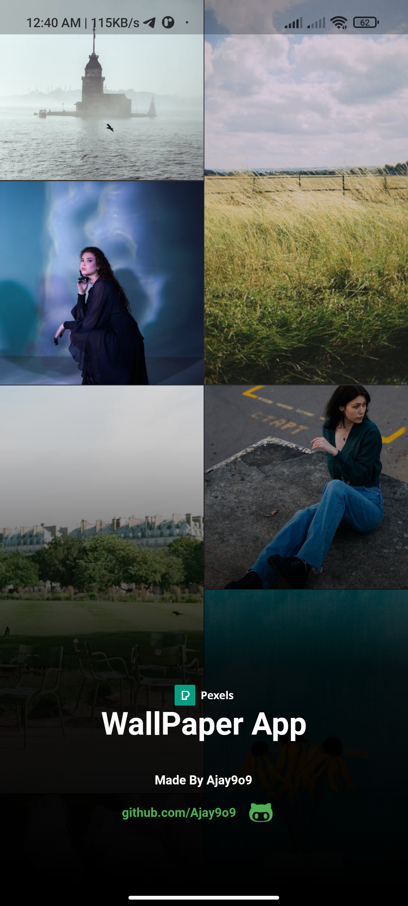
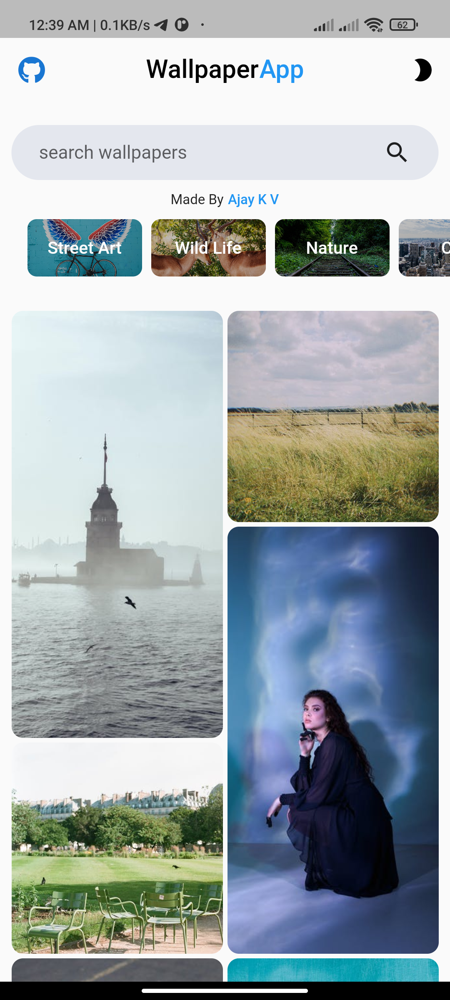
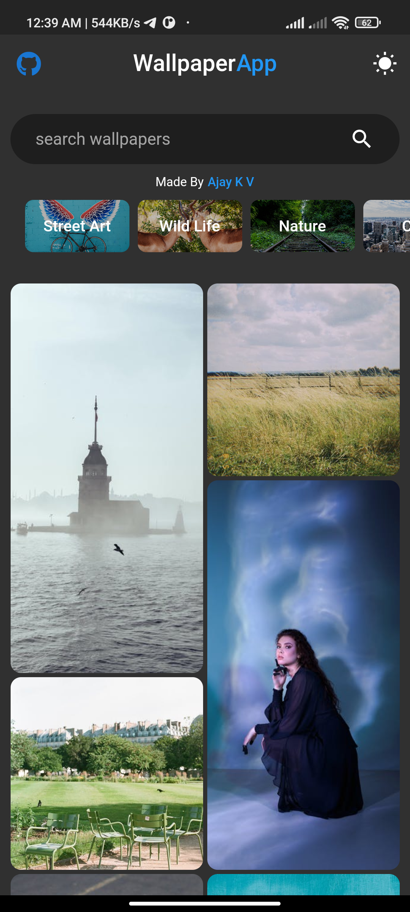
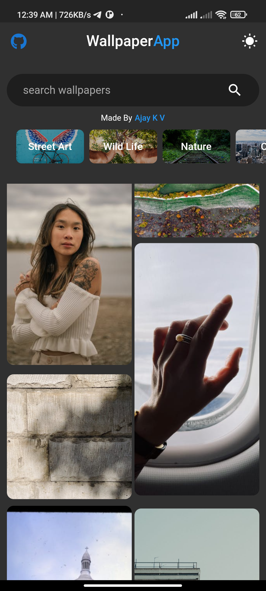

# wallpaper_app

This is a simple wallpaper app made in flutter using pexels api.
You should get your own api key to use with this project.

## Screenshots

## Getting Started

A few resources to get you started if this is your first Flutter project:

- [Lab: Write your first Flutter app](https://flutter.dev/docs/get-started/codelab)
- [Cookbook: Useful Flutter samples](https://flutter.dev/docs/cookbook)

For help getting started with Flutter, view our
[online documentation](https://flutter.dev/docs), which offers tutorials,
samples, guidance on mobile development, and a full API reference.

[My github profile](https://github.com/Ajay9o9)